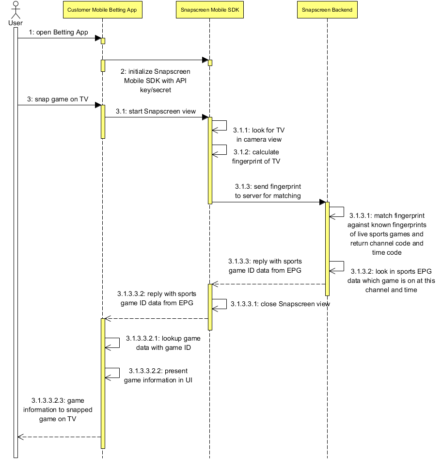

## Documentation

For the full API documentation go to https://snpscrn.github.io/sdk-ios

## Support
In case of any questions or problems please contact us at [support@snapscreen.com](mailto:support@snapscreen.com).

## Requirements

SnapscreenKit requires at least **iOS 10**.

## Integrating SnapscreenKit

### via CocoaPods

Integration via Cocoapods is the easiest way to use SnapscreenKit. Just add the following line to your Podfile.

```
pod 'SnapscreenKit', :git => 'https://github.com/snpscrn/sdk-ios.git'
```

### Manual Integration

SnapscreenKit is provided as an iOS framework and bundles everything necessary for it to operate.


#### Add the SnapscreenKit framework

Drag the SnapscreenKit framework to your iOS project and add it as an **Embedded Framework** in your Build Phase (if not done automatically by Xcode).

#### Add the SnapscreenKit Resource bundle

Drag SnapscreenKit.bundle to your iOS project to include the necessary resources for SnapscreenKit. If you want to change localizations in SnapscreenKit, you can modify the Localizable.strings files in this bundle.

#### Add linker flags

Add the flags **-lc++** and **-ObjC** to the *'Other Linker Flags'* in your projects *Build Settings*.

## Using SnapscreenKit

### Obtain a client ID and secret

Contact Snapscreen to get a clientID and secret for your application.

### Import SnapscreenKit

Add the following line to all classes where you want to access the SnapscreenKit functionality.

```
#import <SnapscreenKit/SnapscreenKit.h>
```

### Add Camera Permission Usage Description if necessary

If you want to access the snapping functionality, starting with iOS 10 it is required by provide a usage description for the camera. This can be done by adding the key **NSCameraUsageDescription** in your application's Info.plist.

### Initialize SnapscreenKit

In order to initialize SnapscreenKit, you need to call the following class method in your AppDelegate in application:didFinishLaunchingWithOptions:

```
[SnapscreenKit sharedSnapscreenKitWithClientID: @"<your-client-id>" clientSecret: @"<your-client-secret>" testEnvironment: NO loggingHandler: nil locationProvider: nil delegate: <delegate>];
```

If you want to provide a Logging Handler or Location Provider, see the documentation for more information on how to do that. Both are not mandatory for SnapscreenKit to function.

Once you have initialized SnapscreenKit, you can also retrieve it by calling

```
[SnapscreenKit sharedSnapscreenKit]
```

## Note about App Store builds

For convenience the framework is a so-called "fat" binary that contains slices for simulator and device architectures. As there is an issue in Xcode that does not correctly strip the unnecessary architectures from a framework you might run into issues when trying to submit your application to the App Store with the framework containing the simulator architecture. To work around this, we recommend to include the following shell script (provided by the Realm project) as a Build Phase in your project to strip the unnecessary slices from your application.

https://github.com/realm/realm-cocoa/blob/d59c86f11525f346c8e8db277fdbf2d9ff990d98/scripts/strip-frameworks.sh

## Snapping TV content

In order to snap a TV image and search for TV channels via SnapscreenKit, you need to first retrieve a SnapscreenSnapViewController by calling

```
SnapscreenSnapConfiguration* configuration = [SnapscreenSnapConfiguration new];
configuration.searchForTvResults = YES;

SnapscreenSnapViewController* snapViewController = [[SnapscreenKit sharedSnapscreenKit] instantiateSnapscreenSnapViewControllerWithDelegate: self resultsDelegate: self configuration: configuration];
```

Once you have retrieved the view controller, it's best to present it modally inside a UINavigationController:

```
[self presentViewController: [[UINavigationController alloc] initWithRootViewController: snapViewController] animated: YES completion: nil];
```

The SnapscreenSnapViewController will send callbacks to the delegate you pass and you are responsible for dismissing the ViewController once it's no longer needed. The ViewController does not dismiss itself in any situation. The **SnapscreenSearchResult** you receive from the delegate callback will have the tvSearchResult set when the search is successful.

## Snapping Sports content


In order to snap a TV image and search for Sports content via SnapscreenKit, you need to first retrieve a SnapscreenSnapViewController by calling

```
SnapscreenSnapConfiguration* configuration = [SnapscreenSnapConfiguration new];
configuration.searchForSportEvents = YES;

SnapscreenSnapViewController* snapViewController = [[SnapscreenKit sharedSnapscreenKit] instantiateSnapscreenSnapViewControllerWithDelegate: self resultsDelegate: self configuration: configuration];
```

Once you have retrieved the view controller, it's best to present it modally inside a UINavigationController:

```
[self presentViewController: [[UINavigationController alloc] initWithRootViewController: snapViewController] animated: YES completion: nil];
```

The SnapscreenSnapViewController will send callbacks to the delegate you pass and you are responsible for dismissing the ViewController once it's no longer needed. The ViewController does not dismiss itself in any situation. The **SnapscreenSearchResult** you receive from the delegate callback will have the sportEventSearchResult set when the search is successful.

The following sequence diagram shows the flow between your app, the SDK and the Snapscreen backend.




## Snapping Advertising content

In order to snap a TV image and search for Advertisements via SnapscreenKit, you need to first retrieve a SnapscreenSnapViewController by calling

```
SnapscreenSnapConfiguration* configuration = [SnapscreenSnapConfiguration new];
configuration.searchForAdvertisements = YES;

SnapscreenSnapViewController* snapViewController = [[SnapscreenKit sharedSnapscreenKit] instantiateSnapscreenSnapViewControllerWithDelegate: self resultsDelegate: self configuration: configuration];
```

Once you have retrieved the view controller, it's best to present it modally inside a UINavigationController:

```
[self presentViewController: [[UINavigationController alloc] initWithRootViewController: snapViewController] animated: YES completion: nil];
```

The SnapscreenSnapViewController will send callbacks to the delegate you pass and you are responsible for dismissing the ViewController once it's no longer needed. The ViewController does not dismiss itself in any situation.  The **SnapscreenSearchResult** you receive from the delegate callback will have the advertisementSearchResult set when the search is successful.

## Displaying and Selecting Snap Results

When snapping returns more than a single snap result and the user has multiple results to choose from, the **SnapscreenSnapResultsViewController** is automatically pushed onto the navigation stack. You can pass an optional resultsDelegate when instantiating the SnapViewController (see above) that implements the **SnapscreenSnapResultsViewControllerDelegate** protocol to control and customize how the results are displayed. This is optional and SnapscreenKit provides a default implementation. The **SnapscreenSnapResultsViewControllerDelegate** provides you with a callback that delivers the result entry that the user selected.

## Localization

If you want, you can customize several messages that are shown in the UI by overriding the Localization keys defined in SnapscreenKit.bundle in your own Localizable.strings files.

## Customizing Appearance

The SnapscreenSnapViewController supports customization of the following properties:

* **UINavigationBar** and **UIBarButtonItem** can be customized via the UIAppearace APIs
* The color of the view finder can be customized by setting the **tintColor** of SnapscreenSnapViewController
* The image for the snap button can be customized by setting the *snapButtonImage** of SnapscreenSnapViewController

## Implement Live / AR view

SnapscreenKit also offers you the ability to provide AR-like experiences that allow you to overlay information onto the live camera image based on the snapped content and position. In order to use this, you need to instantiate a different view controller that provides detailed callbacks to a specific delegate *SnapscreenARSnapViewControllerDelegate***.

```
[[SnapscreenKit sharedSnapscreenKit] instantiateARSnapscreenSnapViewControllerWithDelegate: <delegate> configuration: configuration]
```

The delegate provides you with callbacks with a view that you may add your custom drawing logic to and provides callbacks when results are found and lost in the live camera view including details about the result as well as an exact position in screen coordinates.

## Sharing Clips

In order to snap a TV image, let the user trim a given video clip around the snap timestamp and share this clip via SnapscreenKit, you need to instantiate a SnapscreenClipSharingNavigationController or SnapscreenClipSharingViewController.

We recommend using the SnapscreenClipSharingNavigationController and presenting it modally in your modally.

```
SnapscreenClipSharingConfiguration* configuration = [SnapscreenClipSharingConfiguration new];

// Set appropriate configuration properties

SnapscreenClipSharingNavigationController* sharingNavigationController = [[SnapscreenClipSharingNavigationController alloc] initWithConfiguration: configuration delegate: self];
```

The ViewController will send callbacks to the delegate you pass and you are responsible for dismissing the ViewController once it's no longer needed. The ViewController does not dismiss itself in any situation. The **SnapscreenClipShareInformation** you receive from the delegate callback will have the necessary information about the clip a user wants to share.

The tutorial is shown the first time the users opens clip sharing. After that first time, the user defaults value with the key SnapscreenSDK_ClipSharingTutorialSeenUserDefaultsKey (value "SnapscreenSDK_ClipSharing_Tutorial_Seen") is set to true to indicate that the user has seen the tutorial and it should not be shown again. You can explicitly set this user defaults value on your own to control if the tutorial should be shown or not.

### Asset guidelines

We recommend the following minimum heights for the images that can be provided. Please note that the sizes are provided in 1x scale - so you need to provide according images in higher for high-resolution devices as well. Also note that the SDK configuration interface allows to programmatically limit the heights of the images so you can manually optimize the layout for various device sizes.

* tutorialLogoImage: no recommendation
* largeSponsorImage: 150px
* largeTutorialSponsorImage: 150px
* smallSponsorImage: 50px
* tutorialBackgroundImage: iPhone height
* sharingIntroductionHintImage: 50px
* tutorialContent Images: at least 400px

## Support

In case of any questions or problems please contact us at [support@snapscreen.com](mailto:support@snapscreen.com).
